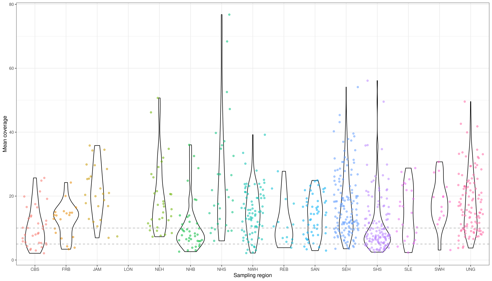
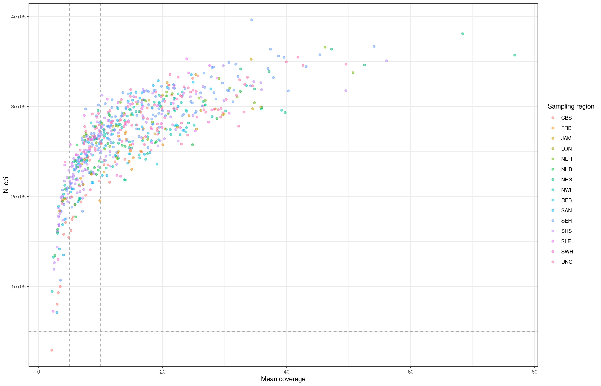

# R scripts, figures and results for MS:
## Reduced representation and whole-genome sequencing approaches highlight beluga whale populations associated to eastern Canada summer aggregations
### Pt. I: SNP detection from raw ddRAD reads for eastern Canada beluga whale samples

__Main authors:__  Luca Montana and Audrey Bourret  
__Affiliation:__  Fisheries and Oceans Canada (DFO)   
__Group:__        Laboratory of genomics   
__Location:__     Maurice Lamontagne Institute  
__Affiliated publication:__ Montana L, Bringloe TT, Bourret A, Sauvé C, Mosnier A, Ferguson SH, Postma L, Lesage V, Watt CA, Hammill MO, Parent GJ (under review). Reduced representation and whole-genome sequencing approaches highlight beluga whale populations associated to eastern Canada summer aggregations. Evolutionary Applications
__Contact:__      e-mail: luca.montana@usherbrooke.ca

- [Objective](#objective)
- [Summary](#summary)
- [Status](#status)
- [Contents](#contents)
- [SNPs detection summary sigures](#snps-detection-summary-figures)
- [Requirements](#requirements)
- [Acknowledgements](#acknowledgements)

## Objective

Effective conservation strategies inherently depend on preserving populations, which in turn requires accurate tools for their detection. Beluga whales (*Delphinapterus leucas*) inhabit the circumpolar Arctic and form discrete summer aggregations. Previous genetic studies using mitochondrial and microsatellite loci have delineated distinct populations associated to summer aggregations but the extent of dispersal and interbreeding among these populations remains largely unknown. Such information is essential for the conservation of populations in Canada as some are endangered and harvested for subsistence by Inuit communities. Here, we used reduced representation and whole-genome sequencing approaches to characterize population structure of beluga whales in eastern Canada and examine admixture between populations. A total of 905 beluga whales sampled between 1989 and 2021 were genotyped. Six main genomic clusters, with potential subclusters, were identified using multiple proxies for population structure. Most of the six main genomic clusters were consistent with previously identified populations, except in southeast Hudson Bay where two clusters were identified. Beluga summer aggregations may consequently be comprised of more than one distinct population. A low number of dispersers were identified between summer aggregations and limited interbreeding was detected between the six genomic clusters. Our work highlights the value of genomics approaches to improve our understanding of population structure and reproductive behavior in beluga whales, offering insights applicable to other cetacean species of conservation concern. An expansion of the geographical scope and increase in number of genotyped individuals will, however, be needed to improve the characterization of the finer scale structure and of the extent of admixture between populations.

The scripts, dataset and results relative to this publication are divided in two GitHub repositories:
1) MOBELS_PopStructure_ddRAD_MS_SNPdiscovery - for loci and SNP detection for ddRAD reads using the Stacks 2 pipeline (THIS REPOSITORY)
2) MOBELS_PopStructure_ddRAD_MS_PopGenAnalyses - filtering and population genomic analyses

## Status
Completed

## Contents
### Folder structure

    .
    ├── OO_Data     # Folder containing data used for the analyses 
    ├── 01_Code     # R scripts  
    ├── 02_Results  # Main results      
    └── README.md

### Main scripts

[**02_Create_PopMap.R**](01_Scripts/02_Create_PopMap.R) Create popmap file necessary to run the gstacks unit of Stacks 2.

[**03_Discovered_SNPs.R**](01_Scripts/03_Discovered_SNPs.R) Processing of raw ddRAD reads to create loci from paired-end reads aligned to the *Delphinapterus leucas* reference genome[[1]](#reference1). 

## SNPs detection summary figures

|  |
|:--:| 
| **Read depth** Mean read depth (coverage) for ddRAD reads from eastern Canada beluga whale samples. Coverages are presented per sampling region. |

|  |
|:--:| 
| **Number of loci** Number of loci detected for ddRAD reads from eastern Canada beluga whale samples according to mean read coverage. Colors represent the sampling region of origin of samples. |

## Requirements
Raw sequence data for the *Delphinapteus leucas* ddRAD and lcWGS datasets are available in the Sequence Read Archive (SRA) under the BioProject accession PRJNA984210. 

## Acknowledgements
We are grateful to Nunavik and Nunavut Inuit hunters and stakeholders for providing beluga whale samples. We also acknowledge Denise Tenkula, Laura Benestan, Frédérique Paquin, Éric Parent, Claudie Bonnet, Justine Hudson, and Grégoire Cortial for preparing samples for genomic sequencing. This project was funded by Nunavik Inuit Land Claims Agreement (NILCA) funding and DFO Results Funds.

## References

<a name="reference1">[**1**]</a> Bringloe, T.T. and Parent, G.J., 2023. Contrasting new and available reference genomes to highlight uncertainties in assemblies and areas for future improvement: an example with monodontid species. BMC genomics, 24(1), p.693. DOI: [10.1186/s12864-023-09779-3](https://doi.org/10.1186/s12864-023-09779-3).